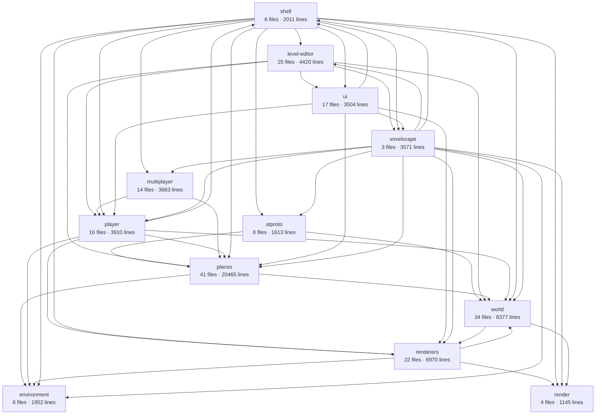

# What voxelscape is made of

Drawn from the imports under `src` at 19efcbd by `pnpm architecture`.
Nothing here is written by hand: change the code and run it again.

## The areas

| area           | what it is for                                                         | files | lines |
| -------------- | ---------------------------------------------------------------------- | ----- | ----- |
| `shell`        | the page, the console, and what wires a world into them                | 6     | 2011  |
| `voxelscape`   | one world: its frame, and every part below it                          | 3     | 3571  |
| `world`        | voxels, light, the streaming window, and the workers that fill it      | 34    | 8377  |
| `renderers`    | turning voxels into geometry, and drawing it                           | 22    | 6970  |
| `render`       | the frame loop, the resolution scaler, and the probe that times them   | 4     | 1145  |
| `player`       | the body, its input, its tools and what they do to the world           | 16    | 3910  |
| `multiplayer`  | other players, over a peer connection                                  | 14    | 3663  |
| `places`       | a published place: its script, its people, and the sandbox they run in | 41    | 20465 |
| `environment`  | the sky, the clock, the weather and the sound                          | 6     | 1952  |
| `atproto`      | being signed in, and reading and writing published records             | 8     | 1613  |
| `ui`           | what is drawn over the world in the page                               | 17    | 3504  |
| `level-editor` | editing the running world's structures, as an overlay on its canvas    | 25    | 4420  |

## What reaches into what

| area           | imports from   | modules doing it |
| -------------- | -------------- | ---------------- |
| `atproto`      | `places`       | 3                |
| `atproto`      | `world`        | 2                |
| `level-editor` | `places`       | 3                |
| `level-editor` | `player`       | 1                |
| `level-editor` | `ui`           | 1                |
| `level-editor` | `voxelscape`   | 3                |
| `level-editor` | `world`        | 6                |
| `multiplayer`  | `places`       | 4                |
| `multiplayer`  | `player`       | 1                |
| `places`       | `environment`  | 1                |
| `places`       | `world`        | 9                |
| `player`       | `environment`  | 1                |
| `player`       | `places`       | 2                |
| `player`       | `renderers`    | 1                |
| `player`       | `shell`        | 4                |
| `player`       | `world`        | 8                |
| `renderers`    | `environment`  | 1                |
| `renderers`    | `render`       | 2                |
| `renderers`    | `world`        | 13               |
| `shell`        | `atproto`      | 4                |
| `shell`        | `environment`  | 2                |
| `shell`        | `level-editor` | 1                |
| `shell`        | `multiplayer`  | 2                |
| `shell`        | `places`       | 3                |
| `shell`        | `player`       | 2                |
| `shell`        | `render`       | 2                |
| `shell`        | `renderers`    | 2                |
| `shell`        | `ui`           | 2                |
| `shell`        | `voxelscape`   | 2                |
| `shell`        | `world`        | 3                |
| `ui`           | `places`       | 4                |
| `ui`           | `player`       | 5                |
| `ui`           | `renderers`    | 1                |
| `ui`           | `shell`        | 2                |
| `ui`           | `voxelscape`   | 10               |
| `voxelscape`   | `atproto`      | 1                |
| `voxelscape`   | `environment`  | 1                |
| `voxelscape`   | `level-editor` | 1                |
| `voxelscape`   | `multiplayer`  | 1                |
| `voxelscape`   | `places`       | 1                |
| `voxelscape`   | `player`       | 1                |
| `voxelscape`   | `render`       | 2                |
| `voxelscape`   | `renderers`    | 1                |
| `voxelscape`   | `shell`        | 1                |
| `voxelscape`   | `world`        | 1                |
| `world`        | `render`       | 2                |
| `world`        | `renderers`    | 5                |

## Areas that reach both ways

- `level-editor` and `voxelscape`
- `player` and `shell`
- `renderers` and `world`
- `shell` and `ui`
- `shell` and `voxelscape`
